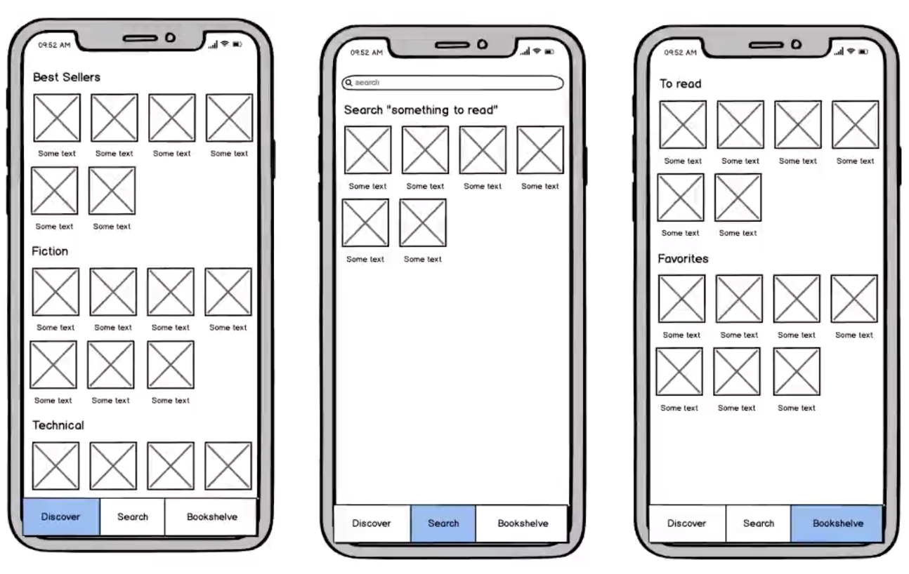
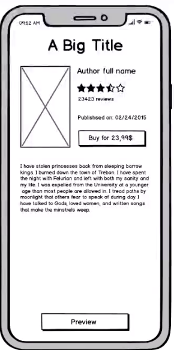

# MIDIA app

Aplicación iOS en Swift realizada como práctica para el módulo de **iOS Avanzado** del **bootcamp de KeepCoding**. Se trata de una app de catálogo de *media* que podremos reutilizar indistintamente para libros, videojuegos, películas, series, etc, gracias a la abstracción.

## Instalación
>>**Para poder utilizar la API de Google Books debemos crear el archivo ApiKeys.plist en el que añadiremos nuestro API Key de Google**

Para crear el ApiKeys.plist usa: File – New – File en Xcode y crea un archivo de tipo Property List. Selecciona Siguiente y nombra el archivo como ApiKeys (el tipo de archivo plist se creará automáticamente). Una vez creado el archivo ApiKeys.plist añadiremos la variable API_KEY_GOOGLE y como valor nuestra API Key.

## Mockups

## Habilidades adquiridas con la realización de la práctica

* Networking (URLSession, Alamofire)
* Concurrencia (GCD, Threads)
* Persistencia (UserDefaults, CoreData)
* Programación funcional
* Capas de abstracción
* Codable
* Autolayout, stackviews
* Cocoa (CollectionViews, TabBars, SearchBar)
* Generics
* Cocoapods
* TDD

